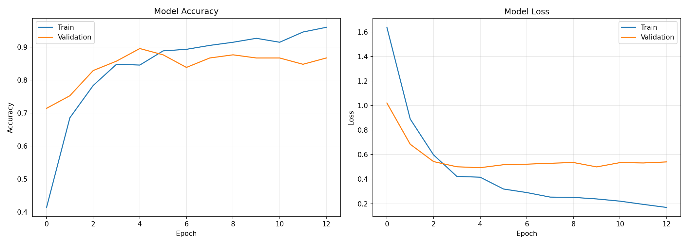
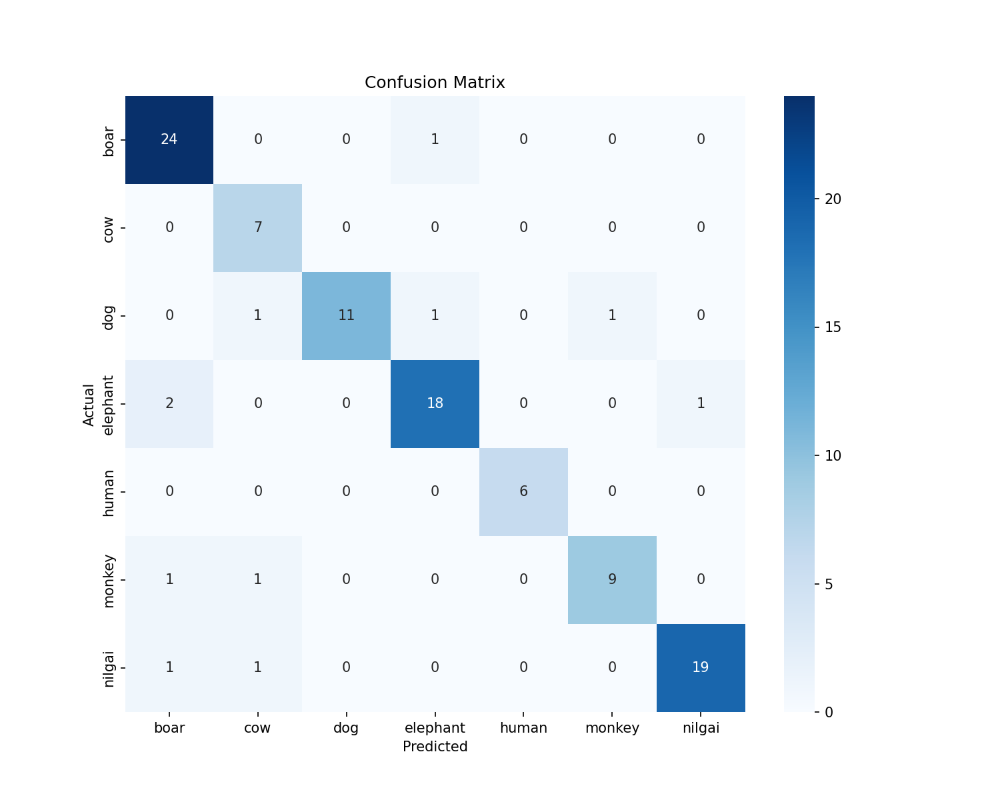

# 🌾 CropGuardAI - Edge-Optimized Wildlife Detection

[](https://github.com/adity0208/CropGuardAI)
[](https://github.com/adity0208/CropGuardAI)
[](LICENSE)

## 📋 Overview
CropGuardAI is a lightweight deep learning model designed to detect and classify wildlife species in real-time on edge devices. Built with MobileNetV2 and optimized for deployment on Raspberry Pi, mobile phones, and microcontrollers.

**Detects 7 Classes:**
🦌 Boar | 🐄 Cow | 🐕 Dog | 🐘 Elephant | 👤 Human | 🐒 Monkey | 🦌 Nilgai

## 🎯 Key Features
- **Edge-Optimized:** 965 KB model size
- **High Accuracy:** 89.52% validation accuracy
- **Real-Time:** <100ms inference on Raspberry Pi 4
- **Cross-Platform:** Runs on Android, iOS, Raspberry Pi, ESP32
- **Low Power:** Suitable for battery-powered devices

## 📊 Performance

| Metric | Value |
|--------|-------|
| Architecture | MobileNetV2 (α=0.35) |
| Input Size | 160×160×3 |
| Parameters | 492,647 total (82,439 trainable) |
| Model Size (FP16) | 965 KB |
| Validation Accuracy | 89.52% |
| Training Dataset | 525 images (7 classes) |

### Training Curves


### Confusion Matrix


## 🚀 Quick Start

### Prerequisites
```bash
pip install tflite-runtime numpy pillow
```
## 🌐 Live Demo

[](https://huggingface.co/spaces/Adityakushwh/CropGuardAI)
[](https://colab.research.google.com/github/adity0208/CropGuardAI/blob/main/notebooks/cropguardai_training.ipynb)
